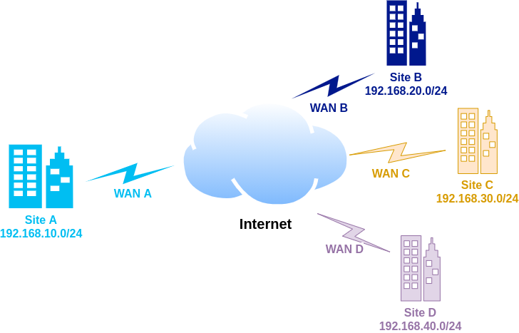

# WireGuard Multi-Site VPN



Ensure you have TCP and UPD ports forwarding to the wireguard instances eth IP Address in your router/gateway

### Ensure you have wireguard kernel module active:

```modinfo wireguard```

### Ensure you have wireguard-tools installed:

```dnf install wireguard-tools```

### Ensure you have IPv4 forwarding enabled and IPv6 disabled in /etc/sysctl.conf:
```
net.ipv4.ip_forward = 1
net.ipv6.conf.all.disable_ipv6 = 1
net.ipv6.conf.default.disable_ipv6 = 1
net.ipv6.conf.lo.disable_ipv6 = 1
```

### If you use firewalld ensure you have masquerade and ports enabled:
```
firewall-cmd --add-port=15380/tcp
firewall-cmd --add-port=15380/udp
firewall-cmd --zone=public --add-masquerade
```

### Connect tunnels at boot time: 

```systemctl enable wg-quick@wg0.conf```

### Split-tunnel by default

If you want full-tunnel in your sites, change sites B, C and D configuration files:

```AllowedIPs = 0.0.0.0/0```

To route all traffic through wireguard tunnel in order to use site-A to reach internet
